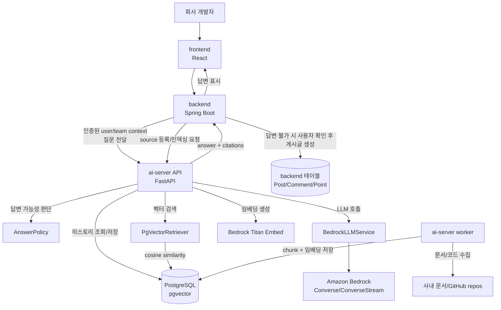

# AskHub AI Server 아키텍처

## 전제와 경계

- 이 문서는 `ai-server` 레포에서 관리한다.
- `backend`와 `frontend` 레포는 읽기 전용으로 참고만 하며, 이 레포에서 수정하지 않는다.
- `ai-server`는 AI 채팅, 대화 히스토리, RAG 검색, 출처 구성, 답변 불가 판단, 파일 관리, ingestion을 담당한다.
- 사용자 인증, 사용자/팀/권한 원장, 커뮤니티 게시글/댓글/포인트/상품 교환은 backend가 담당한다.
- MVP에서는 단일 EC2의 공통 PostgreSQL 16 + pgvector 인스턴스를 backend와 ai-server가 함께 사용한다.
- 공통 DB를 사용하되 schema/table ownership은 엄격히 분리한다. backend와 ai-server는 각자 소유한 schema/table만 마이그레이션하고 쓰기 작업을 수행한다.

## 전체 구조



## 왜 이 구조를 선택했는가

- 책임 분리가 명확하다. backend는 인증과 커뮤니티를 책임지고, ai-server는 AI 채팅과 RAG 전체를 책임진다.
- backend 부담을 줄인다. 채팅 히스토리 조회/저장, RAG 검색이 ai-server 안에서 완결되므로 backend와 ai-server 사이 왕복이 줄어든다.
- 보안 경계가 단순하다. 브라우저가 `user_id`, `team_id`를 직접 주장하지 않고 backend가 검증한 context만 ai-server에 전달한다.
- 팀/레포별 접근 제어를 강제하기 쉽다. ai-server는 backend가 넘긴 팀 권한을 pgvector 검색 필터로 사용해 자료 범위를 제한한다.
- 출처 표기가 안정적이다. `document_chunks` 테이블의 metadata에 repo, commit SHA, path, line range를 저장하면 답변 출처를 재현 가능하게 만들 수 있다.
- 모델 교체가 쉽다. `LLMProvider`와 `Retriever` 인터페이스를 두면 Bedrock 모델과 검색 방식을 단계적으로 교체할 수 있다.

## 배포 구조

MVP에서는 EC2 한 대에 Docker Compose로 전체 서비스를 올린다.

```text
┌─────────────── EC2 인스턴스 ───────────────┐
│  docker-compose.yml                        │
│  ┌──────────┐ ┌──────────┐ ┌────────────┐ │
│  │ backend  │ │ ai-server│ │ PostgreSQL │ │
│  │ :8080    │ │ :8000    │ │ + pgvector │ │
│  └──────────┘ └──────────┘ │ :5432      │ │
│                             └────────────┘ │
└────────────────────────────────────────────┘
```

PostgreSQL은 어떤 애플리케이션 서비스에도 속하지 않는 공통 인프라다. backend와 ai-server는 같은 DB 인스턴스에 접속하지만, 테이블 소유권과 migration 책임은 분리한다. 업로드 파일 본문은 Docker volume이 아니라 S3에만 저장하고, DB에는 S3 위치와 메타데이터만 저장한다.

권장 DB 구조:

```text
PostgreSQL 16 + pgvector
database: askhub
schema: backend  -> backend 소유 테이블
schema: ai       -> ai-server 소유 테이블
```

MVP에서 schema 분리가 당장 어렵다면 테이블 prefix를 사용한다.

```text
backend_users
backend_posts
ai_chat_sessions
ai_messages
ai_document_chunks
```

다만 장기적으로는 `backend` schema와 `ai` schema를 분리하는 방식을 우선 권장한다.

## DB 소유권 원칙

- backend는 `backend` schema만 migration하고 쓰기 작업을 수행한다.
- ai-server는 `ai` schema만 Alembic으로 migration하고 쓰기 작업을 수행한다.
- ai-server는 backend의 `users`, `teams` 테이블을 직접 수정하지 않는다.
- backend는 ai-server의 `chat_sessions`, `messages`, `document_chunks` 테이블을 직접 수정하지 않는다.
- ai-server의 `user_id`, `team_id`는 backend의 ID 값을 저장하되, 초기 MVP에서는 강한 FK를 걸지 않는다.
- 강한 FK는 배포 순서와 migration 의존성을 만들 수 있으므로, MVP에서는 애플리케이션 레벨 검증과 backend가 넘긴 인증 context를 신뢰 경계로 사용한다.
- 필요 시 읽기 전용 권한을 제한적으로 부여할 수 있지만, 쓰기 권한은 서비스별 schema에 한정한다.

권장 DB 계정:

```text
backend_user: backend schema read/write 권한
ai_user: ai schema read/write 권한
```

## DB 테이블 소유권

| 테이블 | 권장 schema | 소유 | 관리 방식 | 비고 |
|--------|-------------|------|----------|------|
| `users`, `teams`, `user_teams` | `backend` | backend | JPA/Hibernate | 인증/사용자/팀 원장 |
| `posts`, `comments`, `points`, `rewards` | `backend` | backend | JPA/Hibernate | 커뮤니티/포인트 도메인 |
| `chat_sessions` | `ai` | ai-server | SQLAlchemy + Alembic | backend user/team ID 값을 저장하되 FK는 MVP에서 보류 |
| `messages` | `ai` | ai-server | SQLAlchemy + Alembic | user/assistant 대화 히스토리 |
| `user_files` | `ai` | ai-server | SQLAlchemy + Alembic | 업로드 파일 메타데이터 |
| `rag_sources` | `ai` | ai-server | SQLAlchemy + Alembic | GitHub repo, 문서 URL 등 |
| `document_chunks` | `ai` | ai-server | SQLAlchemy + Alembic | pgvector embedding chunk |
| `ingestion_jobs` | `ai` | ai-server | SQLAlchemy + Alembic | 인덱싱 작업 상태 |

ai-server 테이블 DDL 초안:

```sql
CREATE SCHEMA IF NOT EXISTS ai;

CREATE TABLE ai.chat_sessions (
    id UUID PRIMARY KEY DEFAULT gen_random_uuid(),
    user_id BIGINT NOT NULL,
    team_id BIGINT,
    title VARCHAR(200),
    created_at TIMESTAMP DEFAULT now(),
    updated_at TIMESTAMP DEFAULT now()
);

CREATE TABLE ai.messages (
    id UUID PRIMARY KEY DEFAULT gen_random_uuid(),
    session_id UUID REFERENCES ai.chat_sessions(id),
    role VARCHAR(10) NOT NULL,
    content TEXT NOT NULL,
    answerable BOOLEAN,
    citations JSONB,
    created_at TIMESTAMP DEFAULT now()
);

CREATE INDEX ix_ai_messages_session ON ai.messages(session_id, created_at);

CREATE TABLE ai.user_files (
    id UUID PRIMARY KEY DEFAULT gen_random_uuid(),
    user_id BIGINT NOT NULL,
    team_id BIGINT,
    session_id UUID REFERENCES ai.chat_sessions(id),
    filename VARCHAR(500),
    content_type VARCHAR(100),
    file_size BIGINT,
    storage_path TEXT,
    purpose VARCHAR(20),
    created_at TIMESTAMP DEFAULT now()
);
```

`rag_sources`, `document_chunks`, `ingestion_jobs`는 Alembic migration에서 pgvector extension 활성화와 함께 추가한다.

## 왜 단일 PostgreSQL을 쓰는가

- MVP 비용과 운영 복잡도가 낮다.
- 단일 EC2 Docker Compose에서 백업/볼륨/접속 정보를 한 곳에서 관리할 수 있다.
- pgvector extension을 한 DB 인스턴스에만 설치하면 된다.
- backend와 ai-server가 같은 user/team ID 체계를 공유하기 쉽다.
- schema ownership만 지키면 이후 RDS 분리 또는 서비스별 DB 분리로 확장하기 쉽다.

주의할 점:

- 공통 DB는 편의를 위한 인프라 공유일 뿐, 도메인 소유권 공유가 아니다.
- 한 서비스의 migration이 다른 서비스 테이블을 변경하면 안 된다.
- backend와 ai-server가 같은 테이블에 동시에 write하는 구조는 피한다.
- ai-server가 커뮤니티 게시글을 직접 쓰지 않고 `suggested_post` 초안까지만 반환하는 원칙은 유지한다.

## ai-server 내부 모듈 구조

```text
src/askhub_ai_server/
  api/
    routes/
      health.py
      chat.py          # 세션 관리 + 채팅 + SSE 스트리밍
      files.py          # 파일 업로드/조회
      sources.py        # RAG 소스 등록
      ingestion_jobs.py # 인덱싱 작업 관리
  core/
    config.py           # Bedrock + DB 설정
    database.py         # SQLAlchemy 엔진/세션
    security.py         # service-to-service 인증 검증
  models/
    chat.py             # ChatSession, Message
    document.py         # RagSource, IngestionJob; DocumentChunk는 RAG 검색 단계에서 추가
    file.py             # UserFile
  schemas/
    chat.py             # 요청/응답 Pydantic 모델
    source.py
    ingestion.py
    citation.py
    file.py
  services/
    chat_service.py     # 히스토리 조회 + RAG + LLM 오케스트레이션
    embedding.py        # Bedrock Titan Embed 호출
    retriever.py        # pgvector 벡터 유사도 검색
    answer_policy.py    # 답변 가능 여부 판단
    citation_builder.py # 검색 metadata → Citation 변환
    llm.py              # BedrockLLMService
  ingestion/
    worker.py           # job loop
    jobs.py             # job 처리 로직
    loaders/
      github_loader.py
      document_loader.py
```

## 후속 작업

### P0. Docker-first 기반 안정화 ✅

- ✅ `.env.example`에 Bedrock 관련 변수를 정리했다.
- ✅ `docker compose run --rm api pytest`와 `docker compose run --rm api ruff check .`를 기준 명령으로 유지한다.

### P1. 기본 LLM/SSE 기반 구현 ✅

- ✅ Bedrock LLM(Amazon Nova Lite)을 구현했다. Bedrock 실패 시 mock fallback은 사용하지 않는다.
- ✅ SSE token streaming 유틸리티를 구현했다.
- ✅ `POST /v1/sources`, `POST /v1/ingestion-jobs`, `GET /v1/ingestion-jobs/{job_id}`를 DB 영속 API로 구현했다.
- ✅ 과거 공개 endpoint였던 `POST /v1/chat`, `POST /v1/chat/stream`은 세션 기반 API 전환 후 제거했다.

### P2. DB 연결 + 채팅 히스토리 ✅

- ✅ PostgreSQL 연결 설정을 추가했다 (SQLAlchemy + psycopg).
- ✅ ai-server 전용 `ai` schema를 사용한다.
- ✅ Alembic 마이그레이션을 초기화하고 `ai.chat_sessions`, `ai.messages`를 생성했다.
- ✅ `chat_sessions`, `messages` 모델을 만들고 세션 기반 채팅 API로 전환했다.
- ✅ ai-server가 히스토리를 직접 DB에서 조회/저장하도록 변경했다.
- ✅ 실제 FastAPI 호출로 세션 생성, non-streaming 메시지 저장, SSE 메시지 저장을 검증했다.

### P2-후속. 파일 관리

- ✅ `user_files` 모델을 만들고 파일 업로드 API를 추가했다.
- ✅ 파일 본문은 S3에만 저장한다. Docker volume/local storage fallback은 사용하지 않는다.
- ✅ 세션 메시지 API의 `file_ids`를 파일 context 주입 로직과 연결했다. 텍스트는 UTF-8 context로, 이미지와 문서는 Bedrock content block으로 전달한다.

### P3. RAG (pgvector)

- `Retriever` 인터페이스와 `PgVectorRetriever`를 구현한다.
- Bedrock Titan Embed를 호출하여 임베딩을 생성하는 서비스를 만든다.
- `document_chunks` 테이블에 벡터 인덱스(IVFFlat)를 설정한다.
- 채팅 API에 RAG 검색 결과를 LLM context로 주입하는 로직을 통합한다.
- `AnswerPolicy`를 만들어 검색 근거 부족 시 `answerable=false`를 판단한다.
- `CitationBuilder`를 만들어 문서/코드 출처를 공통 형식으로 변환한다.

### P4. Ingestion Worker

- worker process를 실제 job loop로 바꾼다.
- GitHub repo source를 clone/pull하여 코드를 수집하는 loader를 만든다.
- 문서 source를 읽는 loader를 만든다.
- 수집한 파일을 chunk로 분할하고, 임베딩을 생성하여 `document_chunks`에 저장한다.
- `ingestion_jobs` 테이블로 작업 상태를 추적한다.

### P5. 보안과 권한

- backend가 전달한 user/team context를 검증하는 middleware를 추가한다.
- retrieval filter에 team ID를 강제한다.
- prompt injection 방어용 system prompt 정책을 추가한다.

### P6. 배포 준비

- Docker image를 ECR에 push하고 EC2에 배포한다.
- 프로젝트 루트 docker-compose.yml을 만들어 PostgreSQL, backend, ai-server를 통합한다.

## 단계적 구현 순서

1. ~~`BedrockLLMService`를 구현한다.~~ → ✅ 완료.
2. ~~SSE streaming을 구현한다.~~ → ✅ 완료.
3. ~~`sources`와 `ingestion-jobs` API를 DB 영속 API로 구현한다.~~ → ✅ 완료.
4. ~~DB 연결 설정 + Alembic 초기화 + 테이블 생성.~~ → ✅ 완료.
5. ~~채팅 API를 세션 기반으로 전환 + 히스토리 DB 관리.~~ → ✅ 완료.
6. ~~파일 업로드 API 추가.~~ → ✅ 완료.
7. pgvector 벡터 검색 + 임베딩 서비스 구현.
8. RAG를 채팅 API에 통합.
9. AnswerPolicy + CitationBuilder 구현.
10. Ingestion worker 실제 구현.
11. EC2 배포.

## 대안과 보류한 선택지

- AWS Bedrock Knowledge Bases 사용은 보류한다. pgvector를 직접 사용하여 벡터 저장소를 자체 관리한다. 이 방식이 비용이 낮고 PostgreSQL 하나로 통합할 수 있다.
- OpenSearch Serverless는 보류한다. pgvector로 충분한 성능이 나오지 않을 때 2차 선택지로 둔다.
- ai-server가 커뮤니티 게시글을 직접 DB에 쓰는 구조는 보류한다. 게시글/댓글/포인트는 backend 도메인이므로 ai-server는 `suggested_post` 초안까지만 생성한다.
- frontend가 ai-server를 직접 호출하는 구조는 보류한다. 직접 호출이 필요해지면 backend가 발급한 짧은 TTL의 서명 토큰과 CORS 정책을 별도로 설계한다.
- ECS Fargate 배포는 보류한다. MVP에서는 EC2 한 대에 Docker Compose로 배포한다.
